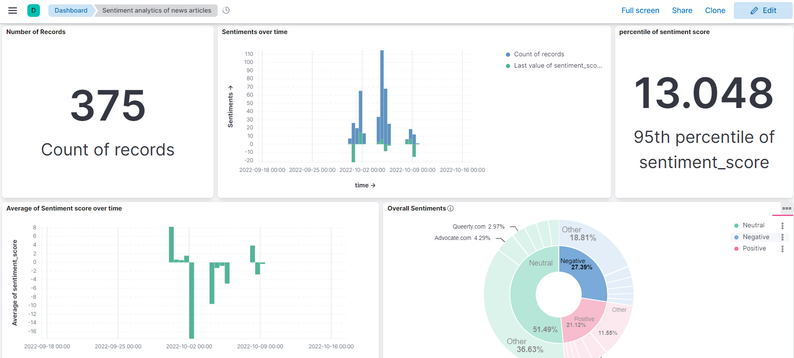

# SENCE-MEDIA
A real-time analytics program for detection of Hate speech on social media and analysing sentiments of news media articles.

**Table of Contents**
- [SENCE-MEDIA](#sence-media)
  - [The Goal](#the-goal)
  - [Inspiration](#inspiration)
  - [What it does](#what-it-does)
  - [How I built it](#how-i-built-it)
  - [What I learned](#what-i-learned)
  - [Tools used](#tools-used)
  - [APIS](#apis)
  - [Project Architechture](#project-architechture)

## The Goal
The idea is to detect hate-speech against individual, community, organization, company on social media and use the data for a better visual representation for analytics. 

Along with hate-speech, the project also focuses on sentiment analysis of news media articles about any of the above mentioned entity and present the resultant data in a dashboard.

## Inspiration
While browsing the internet I came across some negative/abusive comments against a community. People from the around the world were abusing the members on social and news media.

So, I thought, let's make a real time analytics pipeline where we can see how a community, individual is treated on social media and on the internet.

## What it does
The concept is simple. A pipeline that takes data from different sources, like Twitter, news APIs, send them via Kafka brokers to an Elasticsearch index which is finally used by Kibana for visual representation.

## How I built it
- The main components are containerized using Docker. Thus, a single docker-compose command fires up the entire pipeline. 
- Containers include "Apache Kafka", "Zookeeper", "Elasticsearch", and "Kibana".
- The producer and consumer services are built using "fastAPI".
- The Machine Learning section is handled by **Expert.ai** APIs. Includes Sentiment Analysis and the Hate-Speech detection algorithm. Expert.ai makes building ML pipeline very easy and hassle free.

## What I learned
Well, I have learned a lot. Before this I've never used ELK stack. And after building this project, I now atleast have an idea of why and how to use ELK stack in a data pipeline.

## Tools used
- fastAPI
- Apache Kafka
- Elasticsearch
- Kibana
- Docker

## APIS
- Twitter V2 API
- NewsAPI

## Project Architechture
